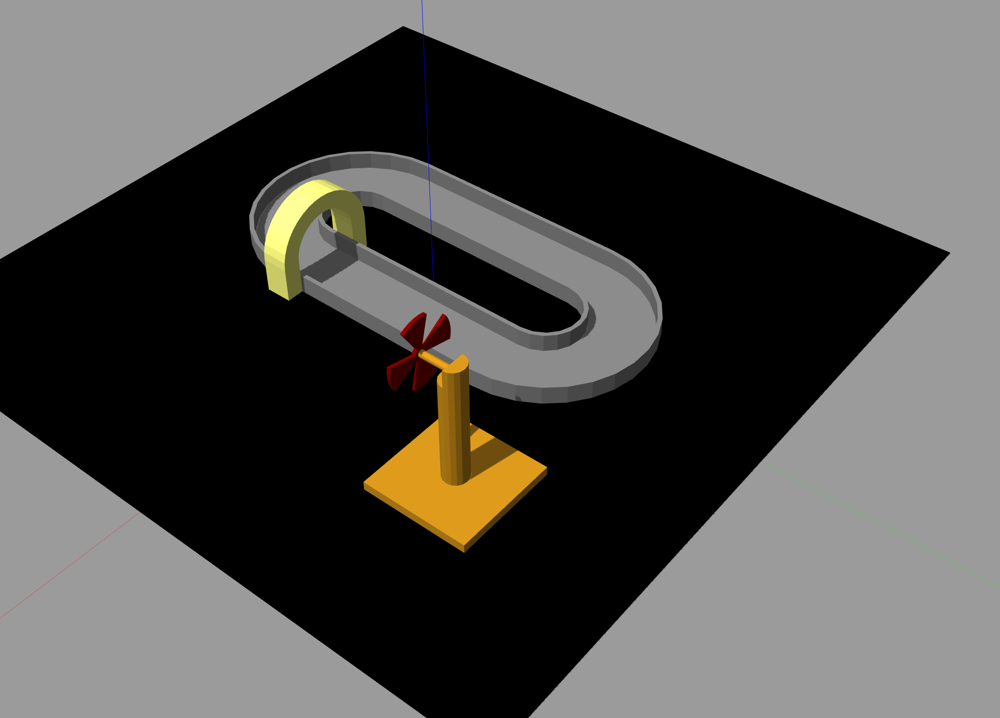

Competition Setup
=====================================================================

Follow the given steps to setup the competition arena for your final video.

In your root folder download the competiton folder using the given command.

.. code-block:: bash

    svn export https://github.com/shantanuparabumd/ENPM-662-Introduction-to-Robot-Modelling.git/trunk/templates/competition

Add the competition folder to your CMakeLists.txt file 

.. code-block:: cmake
    :emphasize-lines: 6

    install(DIRECTORY
        urdf
        meshes
        launch
        worlds
        competition
        DESTINATION share/${PROJECT_NAME}/
        )

Move to the competition folder and run the following command to copy the arena model to the 
Gazebo models location.

.. code-block:: bash

    cd ~/test_ws/src/package-name/competition

.. code-block:: bash

    cp -r arena/ ~/.gazebo/models

Download the competition.launch file to your launch folder by moving into the launch folder and 
running the below command.

.. code-block:: bash

    svn export https://github.com/shantanuparabumd/ENPM-662-Introduction-to-Robot-Modelling.git/trunk/templates/template4/competition.launch.py

Make sure you change the `package_name` to name of your package whereever required.

Also,change the spawn location and orientation of your robot such that the robot is spawned on the track.
These changes can be made in the `spawn_robot_ros2.launch.py` file. 
Note the orientation given in the below code snippet is a ideal location for robot spawnining you have to change it.

.. code-block:: python
    :emphasize-lines: 5,7
    
    package_description = "windmill"

    # Position and orientation
    # [X, Y, Z]
    position = [5.0, 5.0, 1.0]
    # [Roll, Pitch, Yaw]
    orientation = [0.0, 0.0, 0.0]

You can now build your package and launch the competiton using.

.. code-block:: bash

    ros2 launch package_name competition.launch.py

