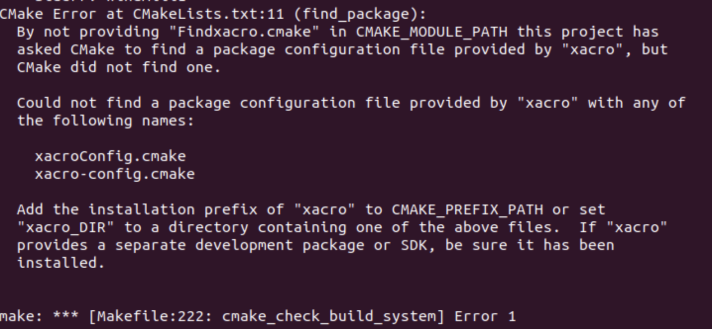
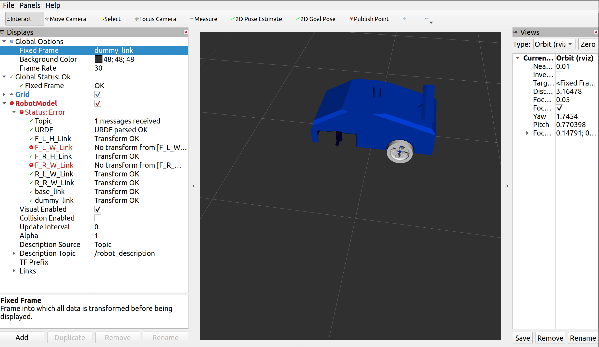
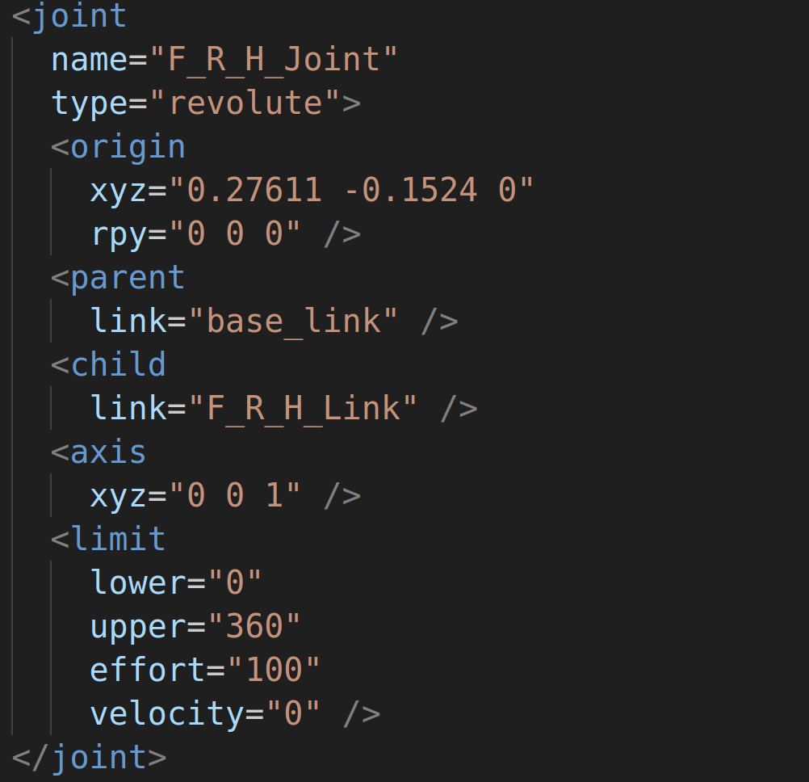

Frequently Faced Errors
================================================================================================

1. Xacro Package is Not Installed
-----------------------------------------------------------------

If you face a error like above. You will need to install the xacro package. This can be done using the following commands.

.. code-block:: bash

      sudo apt install ros-galactic-xacro

2. ROS Controller Manager Not Found
-----------------------------------------------------------------

.. image:: images/ros_controller_manager.png
  :width: 700
  :alt: ROS Controller Manager

If you are facing errors like above. You will need to install the controller manager explicitly. Use the below command.

.. code-block:: bash

      sudo apt-get install ros-galactic-controller-manager

3. Transform Not Available
-----------------------------------------------------------------

If you're encountering issues where your robot spawns correctly in Gazebo but you're getting errors in RViz, particularly related to missing link transforms, it's possible that the problem stems from inaccuracies in the axis definitions for the link joints within your URDF file.

.. code-block:: xml

        # The axis might be either completely 0
        <axis
          xyz="0 0 0"/>
        # The axis might have fractions
        <axis
          xyz="0.0000123 0.998289 0"/>

.. image:: images/link_error_2.png
  :width: 700
  :alt: Incorrect Axis representation

The correct representation of axes should be in the form of whole numbers, as exemplified below.

To resolve this issue, you will need to reconstruct your URDF by exporting the Solidworks Assembly once again. Please consult the software sessions for guidance on how to assign reference axes to the joints. Utilizing reference joints will rectify the problems associated with incorrect joint definitions, ensuring a error-free experience in RViz.

4. Subscribing to IMU Sensor data
-----------------------------------------------------------------
Error

.. code-block:: bash
  
      [WARN] [1698900148.627976887] [minimal_subscriber]: New publisher discovered on topic 'imu_plugin/out', offering incompatible QoS. No messages will be received from it. Last incompatible policy: RELIABILITY

You have to manually change your QOS profile in your script.

To do so:

Add:

.. code-block:: python

        from rclpy.qos import QoSProfile, ReliabilityPolicy, HistoryPolicy

Then, in your init function add:

.. code-block:: python

          qos_profile = QoSProfile(
            reliability=ReliabilityPolicy.BEST_EFFORT,
            history=HistoryPolicy.KEEP_LAST,
            depth=10
            )

Then, in your publisher, instead of queue size = 10, replace the argument in create_subscription with qos_profile:

.. code-block:: python
  
  #Subscribe to the 'imu_plugin/out' topic
  self.imu_sub = self.create_subscription(Imu, 'imu_plugin/out', self.imu_callback, qos_profile) 
  