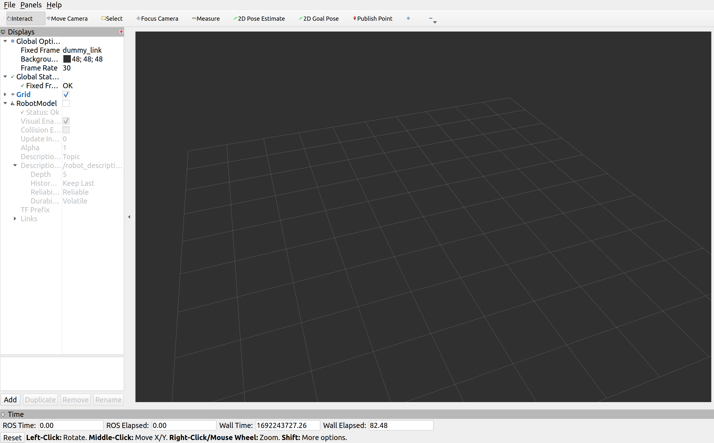
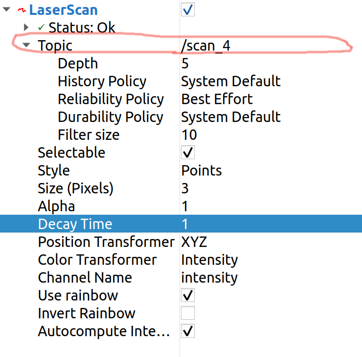

Plugin
=============================================================================================

Plugins are very helpful to add sensors and actuators to your Gazebo Model. We can create custom plugins or use existing plugins that are 
available.

LIDAR
---------------------------------
Here we are going to use a LIDAR plugin to sense the environment of our robot using light rays.

To add a LIDAR we will be utilizing the link that we already created for LIDAR.
We will add the below code to our URDF file.

.. code-block:: xml

    <gazebo reference="add_name_of_your_link">
      <sensor name="lidar" type="ray">
        <pose>0.0 0.0 0.0 0 0 0</pose>
        <always_on>true</always_on>
        <visualize>true</visualize>
        <update_rate>5</update_rate>
        <ray>
          <scan>
            <horizontal>
              <samples>360</samples>
              <resolution>1.00000</resolution>
              <min_angle>0.000000</min_angle>
              <max_angle>6.280000</max_angle>
            </horizontal>
          </scan>
          <range>
            <min>0.120000</min>
            <max>3.5</max>
            <resolution>0.015000</resolution>
          </range>
          <noise>
            <type>gaussian</type>
            <mean>0.0</mean>
            <stddev>0.01</stddev>
          </noise>
        </ray>
        <plugin name="scan" filename="libgazebo_ros_ray_sensor.so">
          <ros>
            <remapping>~/out:=scan</remapping>
          </ros>
          <output_type>sensor_msgs/LaserScan</output_type>
          <frame_name>add_name_of_your_link</frame_name>
        </plugin>
      </sensor>
      </gazebo>

Build your project and use the Launch script to start RVIZ 2.

Click on the Add button on the bottom left corner of the screen.

Select the LaserScan topic from the list.

.. image:: images/laser_topic.png
  :width: 700
  :alt: Add Laser Topic

Use the following configurations for Laser Scanner to work. You can make changes once you are comfortable.
Make sure you change the topic name to the topic of your laser scanner.

IMU
---------------------------------

In order to implememt the closed loop controller we need a feedback from our robot. This feedback will be
the orientation of the robot. To get the orientation of the robot we will be adding an IMU sensor
to the robot.

Add the folowing line to :guilabel:`robot_name.urdf.xacro` file. Make sure you edit the highlighted lines.

.. code-block:: xml
    :emphasize-lines: 1,10,15

    <gazebo reference="name_of_the_base_link">
      <gravity>true</gravity>
      <sensor name="imu_sensor" type="imu">
        <always_on>true</always_on>
        <update_rate>100</update_rate>
        <visualize>true</visualize>
        <topic>__default_topic__</topic>
        <plugin filename="libgazebo_ros_imu_sensor.so" name="imu_plugin">
          <topicName>imu</topicName>
          <bodyName>name_of_the_base_link</bodyName>
          <updateRateHZ>10.0</updateRateHZ>
          <gaussianNoise>0.0</gaussianNoise>
          <xyzOffset>0 0 0</xyzOffset>
          <rpyOffset>0 0 0</rpyOffset>
          <frameName>name_of_the_base_link</frameName>
          <initialOrientationAsReference>false</initialOrientationAsReference>
        </plugin>
        <pose>0 0 0 0 0 0</pose>
      </sensor>
    </gazebo>

Build and Run the project and you should be able to see :guilabel:`\imu` topic in the topic list.
Use the information provided in this topic as a feedback for you robot.

  

Vacuum Gripper
---------------------------------

To add a Vacuum Gripper to your robot manipulator, you can use the similar approach used for adding the 
plugins to your robot.
This plugin is provided to us by :guilabel:`gazebo_plugins` so make sure you have the  package installed.

Add the folowing line to :guilabel:`robot_name.urdf.xacro` file. 

.. code-block:: xml

    <gazebo>
      <plugin name='vacuum_gripper' filename='libgazebo_ros_vacuum_gripper.so'>

        <!-- This part can be commented out if not required -->
        <ros>

          <!-- Add a namespace -->
          
          <namespace>/demo</namespace>

          <!-- Remapping service and topic names -->
          <remapping>switch:=custom_switch</remapping>
          <remapping>grasping:=custom_grasping</remapping>
        </ros>

        <!-- Link associated with gripper -->
        <link_name>link</link_name>

        <!-- Max distance to attract entities -->
        <max_distance>10.0</max_distance>

        <!-- List of entities to be not attracted by the gripper -->
        <fixed>ground_plane</fixed>
        <fixed>wall</fixed>

      </plugin>
    </gazebo>

Build and Run the project and you should be able to see :guilabel:`\namespace\switch` service in the service  list.

Use the below command to get the service list

.. code-block:: bash

    ros2 service list

Use the below command to get the switch on the gripper

.. code-block:: bash

    ros2 service call /vacuum_gripper/switch std_srvs/srv/SetBool data:\ true

Use the below command to get the switch off the gripper

.. code-block:: bash

    ros2 service call /vacuum_gripper/switch std_srvs/srv/SetBool data:\ false

Odometry 
---------------------------------

We use the odometry plugin to get the position and velocity of a link with respect to the stationary world frame.
Once you add the plugin you will have two topics available :guilabel:`\odom` and :guilabel:`\velocity`. 
The :guilabel:`\odom` topic will have the pose and orientation of the link.
The :guilabel:`\velocity` topic will have the linear and angular velocities of the link.

This plugin is provided to us by :guilabel:`odometry` package so make sure you have the  package installed.

**Package Installation Guide lines:**

1. Move to :guilabel:`~/workspace/src`
2. Run the below command to download the :guilabel:`odometry` package.

.. code-block:: bash

  svn export https://github.com/shantanuparabumd/ENPM-662-Introduction-to-Robot-Modelling.git/trunk/templates/plugin/odometry

3. Build the workspace and source.

**Plugin Usage Guideline:**

Add the folowing line to :guilabel:`robot_name.urdf.xacro` file. 

.. code-block:: xml

    <gazebo>
      <plugin filename="libodometry_plugin.so" name="odometry_plugin">
        <!-- Name of the link for which the odometry is required -->
        <frame>blade_link</frame>
        <!-- Any arbitray name for the world frame -->
        <world_frame>fixed_world</world_frame>
      </plugin>
    </gazebo>

Build and Run the project and you should be able to see :guilabel:`\odom`  and :guilabel:`\velocity ` service in the topic list.

Use the below command to get the service list

.. code-block:: bash

    ros2 topic list

Use the below command to echo the topic and also can write a subscriber to get the topic data

.. code-block:: bash

    ros2 topic echo /odom

.. code-block:: bash

    ros2 topic echo /velocity