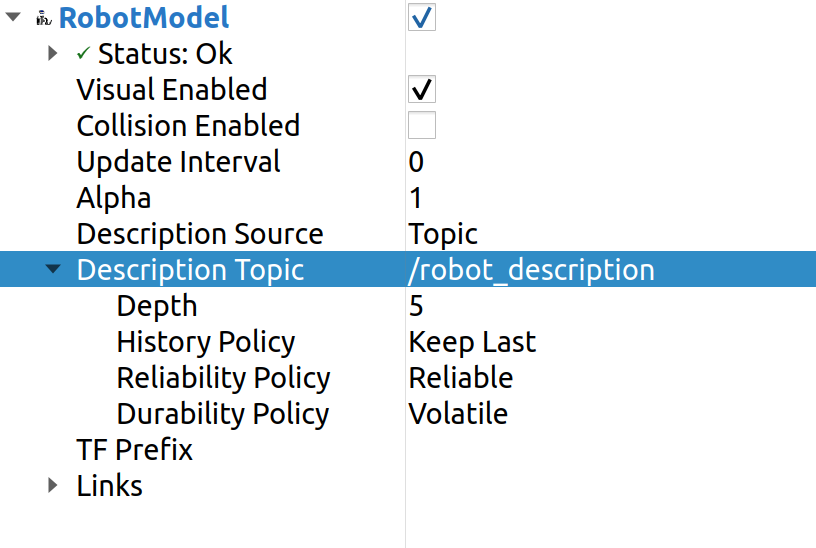

RVIZ
=====================================================================

Visualization is a very important concept in robot simulation. In order to visualize the various sensor inputs like LIDAR, Camera etc. 
we will be using RVIZ 2 a software for visualizing the ROS2 topics. 

RVIZ 2 requires setup and configurations that might be overwhelming at this stage so to help out we will be using a few templates.

We move to the root of our package and then run the code below to download the templates.

.. code-block:: bash

    cd ~/test_ws/src/package-name/

    # Example
    cd ~/test_ws/src/test_package/

.. code-block:: bash

    svn export https://github.com/shantanuparabumd/ENPM-662-Introduction-to-Robot-Modelling.git/trunk/templates/rviz

.. code-block:: bash

    svn export https://github.com/shantanuparabumd/ENPM-662-Introduction-to-Robot-Modelling.git/trunk/templates/template2/launch

So that the robot can move in the RVIZ environment we add a :guilabel:`dummy_link` to our robot. This is
simply done by adding a link and a joint to :guilabel:`robot_name.urdf.xacro` file as follows.

.. code-block:: xml

    # Add this before base link
    <link name="dummy_link"></link>

    # Add this after base link
    <joint name="dummy_joint" type="fixed">
        <origin rpy="0 0 0" xyz="0 0 0" />
        <parent link="dummy_link"/>
        <child link="base_link"/>
    </joint>

File Description:

    * The :guilabel:`gazebo.launch.py` will launch the Gazebo environment and will load the controllers.
    * The :guilabel:`display.launch.py` will launch RVIZ 2 along with the neccessary setup for the Robot Visualization.
    * The :guilabel:`debug.launch.py` will launch both Gazebo and RVIZ 2 together.

Use any of the above launch files as required.

Once RVIZ is launched Add the robot model to the tree.

If the robot is not visible add the topic :guilabel:`/robot_description` to the :guilabel:`Description Topic` argument.

Select :guilabel:`dummy_link` in the :guilabel:`Fixed Frame` argument.

.. image:: images/global_frame.png
  :width: 700
  :alt: Robot Description Topic